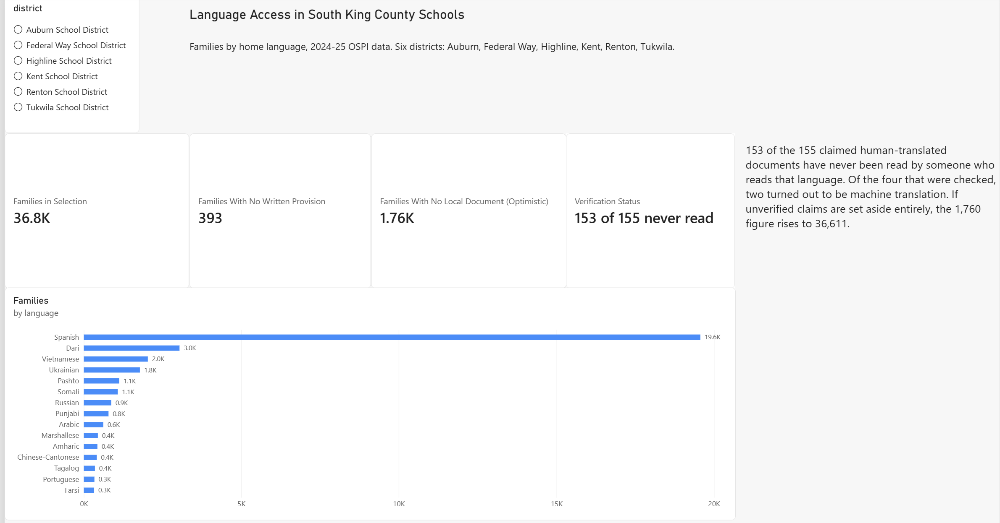
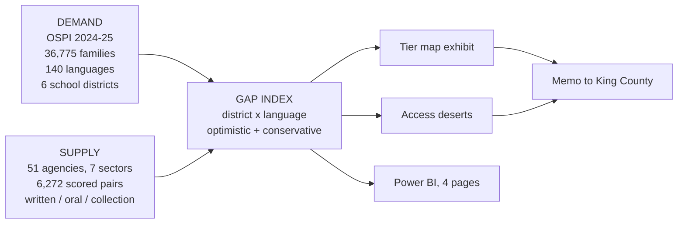
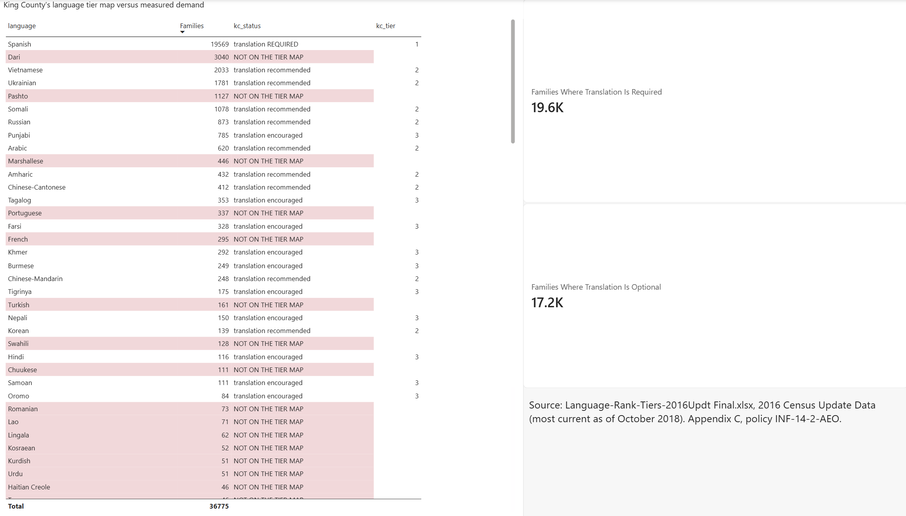
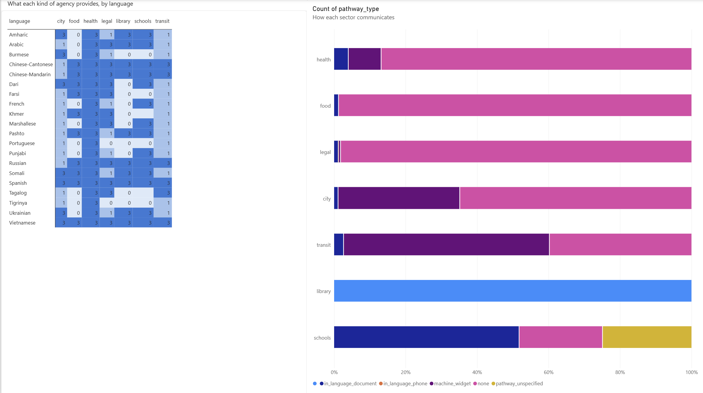
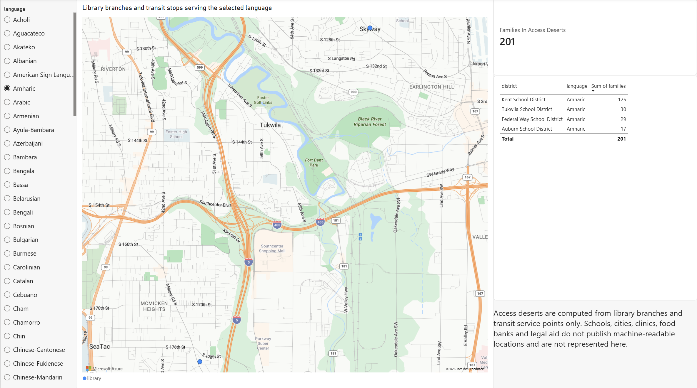

# Language Access in South King County

**Where do people speak a language at home that the public services around them do not actually serve?**



This project answers that question for six school districts in South King County, Washington, by measuring two things separately and then subtracting one from the other:

- **Demand.** 36,775 families, 140 home languages, from Washington State's 2024-25 school enrollment data.
- **Supply.** 51 public agencies across seven sectors, 6,272 scored (agency, language) pairs, every one carrying an evidence URL and a capture date.

Every number below is reproducible from the frozen source data in this repository.



---

## The finding

King County law requires its agencies to translate public communication materials into "the County's top six languages, **based on the County's tier map**" (KCC 2.15.030.B).

That tier map is Appendix C of policy INF-14-2-AEO. Its own header reads:

> Language-Rank-Tiers-2016Updt-Final.xlsx, 2016 Census Update Data (Most current as of October 2018)

It names twenty languages. Spanish alone requires translation. Eight are "recommended", eleven are "encouraged", and everything else in the world is unmentioned.

The Afghan evacuation was August 2021. The full-scale invasion of Ukraine was February 2022.

| Language | Families, six districts | Tier map status |
|---|---|---|
| Spanish | 19,569 | Tier 1, translation required |
| **Dari** | **3,040** | **absent** |
| Vietnamese | 2,033 | Tier 2, recommended |
| Ukrainian | 1,781 | Tier 2, recommended |
| **Pashto** | **1,127** | **absent** |
| Somali | 1,078 | Tier 2, recommended |
| **Marshallese** | **446** | **absent** |

Dari is the second most common home language in the study area. It appears nowhere in the policy that decides who gets translated documents.

**53.2% of families speak the one language where translation is required. The remaining 46.8%, 17,206 families, speak a language where it is recommended, encouraged, or unmentioned.**

The ask that follows is narrow: re-rank the tier map against current data. The ordinance then applies to Dari, Pashto and Marshallese with no further action.

### What the gap looks like on the ground

- **393 families** have no written provision in their language from any agency, at any tier, in any sector.
- **1,760 families** have no translated document from any agency local to them, taking every claimed translation at face value. If unverified claims are set aside entirely the figure is **36,611**. The truth is inside that range and this project reports both ends rather than picking one.
- **Kent School District has 962 Dari-speaking families and not one library branch or transit service point serving Dari.**
- King County publishes seven translated locale paths. Sampling twelve pages across all seven, **71 of 77 comparable page pairs carry main-content text identical to the English page.** The six that differ are the homepage, differing only in the title. The Somali homepage title is "Home".
- King County's Amharic pages are machine translation, identified by a native speaker.

### It is not a capacity problem

**Washington Healthplanfinder** publishes health coverage information in **26 languages**, including Dari, Pashto, Tigrinya, Oromo, Amharic, Somali, Punjabi, Khmer, Lao and American Sign Language. Each carries real in-language text, a translated PDF, and the support line explained in that language. Its Amharic was reviewed by a native speaker for this project and called exemplary.

Same state, same residents, same procurement rules. The gaps documented here are choices.

---

## Three decisions that make the numbers defensible

### 1. The classification rule was written before any data was collected

`docs/CLASSIFICATION_RULE.md` defines the tier scale, the evidence standard and nine edge cases, and it was finished before the first agency was scored. That ordering is the point. A rule written afterwards is a rule fitted to the answer.

The most consequential clause is section 4:

> **Tier 2 requires that the request pathway itself be communicated in that language.**

Most agencies publish some version of "interpreters available in any language on request". Taken at face value, that makes every agency adequate in all 193 languages and the analysis returns no findings. This rule measures access as a family experiences it, not capacity as an agency reports it. It scores some agencies below their real internal capability, and that is the intended reading, stated as a limitation rather than hidden.

### 2. A method was tested and rejected

To map specific languages at neighbourhood resolution, the standard move is apportionment: measure a language's share of its broad Census bucket somewhere coarse, then apply that share to a finer area.

The assumption inside that step is that the language mix is roughly uniform across the region. But this project's entire premise is that these communities cluster, which is the same as saying the mix is *not* uniform. The method risked assuming away the phenomenon being measured, and would have done it invisibly: the output is a smooth, plausible map that is an artifact of arithmetic.

So it was tested, twice, against two independent sources.

**Mean absolute error: 7.1 percentage points across 219 district-language rows.**

Apportionment predicted that Auburn's Pacific Island bucket was 7.5% Marshallese. It is **63.1%**. An eight-fold underestimate of the single most geographically concentrated community in the study area, which is precisely the community an access map most needs to find.

**The method was rejected.** No tract-level specific-language estimates appear anywhere in this project. The map runs at two resolutions and its legend says which applies to each language. A single-resolution map would look better and would be partly fabricated.

Full writeup: `docs/METHODOLOGY.md`.

### 3. The uncertainty is reported, not buried

155 rows in this dataset claim a human-translated document exists. **Two have been read by someone who reads the language.** Of the four that were checked, **two turned out to be machine translation.**

Every gap figure is therefore published in two readings:

| Reading | Assumption |
|---|---|
| `optimistic` | every tier-3 claim is taken at face value |
| `conservative` | any tier 3 not verified by a human reader is demoted |

Both appear in the dashboard and both are in the published data. A single number here would be false precision.

---

## Data sources, and what each can actually do

| Source | Geography | Language detail | Population |
|---|---|---|---|
| OSPI Languages Spoken by Students and Families, 2024-25 | School district | **Specific** | Families with a K-12 student |
| ACS C16001 | Census tract, school district | 12 broad groups | Everyone aged 5+ |
| ACS B16001 | PUMA | 44 groups, still collapsed | Everyone aged 5+ |
| ACS PUMS `LANP` | PUMA | **Specific**, 127 codes | Everyone aged 5+ |

Two findings from building that table are worth stating, because both contradict what the project originally assumed:

- **No published ACS summary table names Amharic separately from Somali anywhere in Washington State.** B16001 lumps them as "Amharic, Somali, or other Afro-Asiatic languages". Dari is inseparable from Farsi. Pashto and Marshallese are not named at any level. Only the PUMS microdata names them, and only at PUMA geography.
- **The ACS publishes `school district (unified)` as a geography.** District-level Census data needs no spatial join and no overlap assumptions.

That is why the OSPI-derived dataset in this repository has value beyond convenience. It contains language-specific counts at a geography that standard published sources cannot produce.

---

## Supply inventory: 51 agencies, seven sectors

| Sector | Agencies |
|---|---|
| Food assistance | 12 |
| Health clinics | 12 |
| Legal aid | 10 |
| City government | 8 |
| School districts | 6 |
| Transit | 2 |
| Library | 1 (King County Library System) |

Each (agency, language) pair carries up to three independent tier scores, never one score for an agency as a whole:

- `written_tier` — has the agency communicated with this community in writing, in their language?
- `oral_tier` — can a speaker of this language talk to a human there?
- `collection_tier` — can they borrow material in it? (library only)

The written/oral split exists because Renton publishes documents in "Chinese" without naming a variety. Written Chinese serves both Cantonese and Mandarin readers. Interpreters do not.

Schools were hand-scored. **Every other sector is `assignment_method = derived`**: applied by code to frozen evidence, and exactly reproducible.

---

## The dashboard

Four pages in Power BI, built on a star schema in `powerbi/`.

| | |
|---|---|
|  |  |
|  |  |

1. **What the data says** — the headline figures and the verification caveat that qualifies them
2. **The ordinance** — the tier map exhibit, with unlisted languages flagged
3. **Who provides what** — a language-by-sector matrix, plus what kind of provision each sector actually offers
4. **Where you can walk in** — physical service points, filtered by language. Pick Spanish and 44 points appear. Pick Dari and there are 2. Pick Pashto, Tigrinya or Khmer and the map is empty, because it genuinely is.

> Live report: _link to be added_

Download the report file: **[language-access-skc.pbix](language-access-skc.pbix)**

It opens in the free Power BI Desktop and carries the four pages, the DAX measures, the relationships and the data. No account needed.

---

<details>
<summary><b>Repository layout</b></summary>

```
data/raw/          frozen API responses and source files, never edited
data/reference/    hand-maintained lookups (language crosswalk, variable lists)
data/processed/    derived tables
data/inventory/    per-sector supply inventories
docs/              CLASSIFICATION_RULE.md, METHODOLOGY.md, DATA_DICTIONARY.md, MEMO.md
outputs/           gap index, validation results, map layers
powerbi/           star schema CSVs, measures.dax, BUILD_GUIDE.md
src/               one script, one job
```

Every downloaded file is frozen in `data/raw/` and every fetch script skips a file already on disk. Sources revise their published data. Without a frozen copy you cannot tell whether a changed number came from your code or from theirs.

</details>

<details>
<summary><b>Reproducing this</b></summary>

```bash
pip install pandas requests geopandas beautifulsoup4 python-dotenv

# Phase 1: demand
python src/fetch_ospi.py
python src/apply_crosswalk.py

# Phase 2: Census integration and the apportionment test
python src/fetch_census.py
python src/fetch_pums.py
python src/fetch_districts.py
python src/validate_apportionment.py

# Phase 3: supply, one script per sector
python src/probe_agency_sites.py
python src/build_kcls_inventory.py
python src/build_transit_inventory.py
python src/build_city_inventory.py
python src/build_legal_inventory.py
python src/build_food_inventory.py
python src/build_health_inventory.py

# Phase 4: join, score, compare
python src/build_master_inventory.py
python src/build_gap_index.py
python src/compare_kc_tier_map.py
python src/audit_kingcounty_locales.py

# Phase 5: robustness and model
python src/sensitivity_analysis.py
python src/build_powerbi_model.py
```

Requires a Census API key in `.env` as `CENSUS_API_KEY`. Run `python src/check_key.py` to verify it. The full sequence is safe to re-run and makes no network requests on a second pass.

</details>

## Is the result stable?

`src/sensitivity_analysis.py` sweeps eleven scenarios across the index weights, the scope weights, the verification assumption and the city-overlap threshold.

- "Families with no written provision anywhere" moves only between **376 and 393** across all eleven.
- Rank correlation with the baseline is **1.000 in six scenarios and above 0.95 in nine of eleven**.
- One scenario flips: dropping the oral term entirely (`written_only`) reorders the ranking, because most languages sit at oral tier 2 and removing that term lets very small languages dominate. It answers a different question, "worst served per family" rather than "largest unmet need", and it is reported rather than smoothed away.

---

## Limitations, stated plainly

1. **Demand and supply are measured on different populations.** Provision covers 51 agencies in seven sectors. Family counts come only from OSPI, which observes households with a K-12 student. Households without school-age children are absent from every count in this project, including counts attached to food banks and clinics. Read every family count as a floor.

2. **OSPI records home language, not English proficiency.** King County's tier map ranks Limited English Proficiency population. The two are not interchangeable and no claim here maps one onto the other.

3. **The web inventory understates reality by design.** A service that exists but is not advertised online scores as absent. Deliberate, per the pathway rule, but it is a bias and it falls hardest on food banks and clinics.

4. **Uneven assessment quality across languages.** The author reads Amharic and can judge whether a document was human-written. For Chuukese or Punjabi the judgment rests on file type and provenance. This is why both of the two verified tier-3 claims in the entire dataset are Amharic.

5. **Single coder.** Every judgment call comes from one person, with no inter-rater reliability statistic. A blind re-score of a ten-row sample would address this cheaply and has not been done.

6. **Access deserts are computed from library branches and transit stops only.** Those are the only sectors publishing machine-readable locations. Schools, cities, clinics, food banks and legal aid are not represented on the map.

7. **Charter and tribal schools are excluded** from the study area.

8. Known issues found in a self-review, unfixed and documented in `CLAUDE.md`: the "local" threshold in the gap index moves with the sensitivity scenario, so `families_no_local_document` is not strictly comparable across scenarios; and no school row can currently hold a `verified_human` flag, which systematically penalises the most locally relevant sector under the conservative reading.

---

## Author

**Elias Hakenso** — data analyst, Burien/SeaTac, Washington.

Amharic speaker, resident of the study area, and inside Highline School District, which accounts for six of the eleven district-language pairs scoring maximum severity in this dataset.

The Amharic quality checks in this project were made first-hand for that reason.

[github.com/Elias0305Ha](https://github.com/Elias0305Ha)
